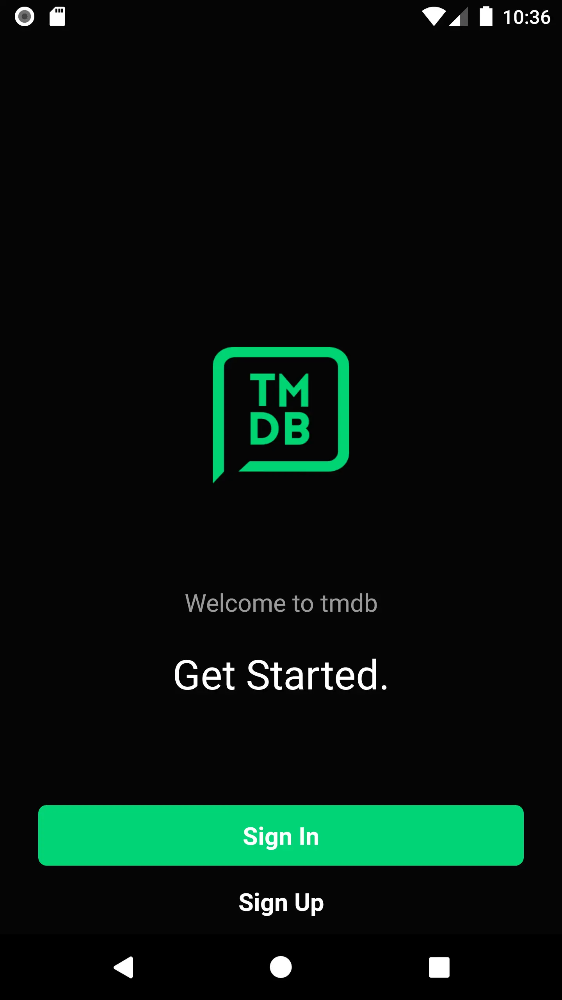
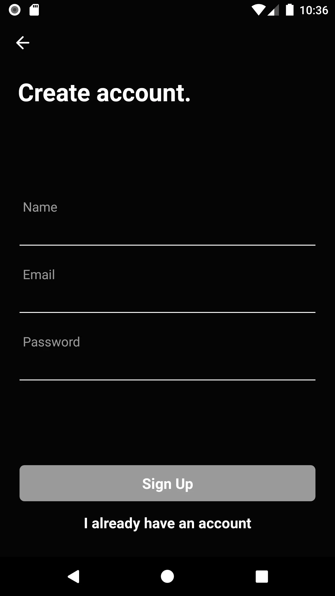
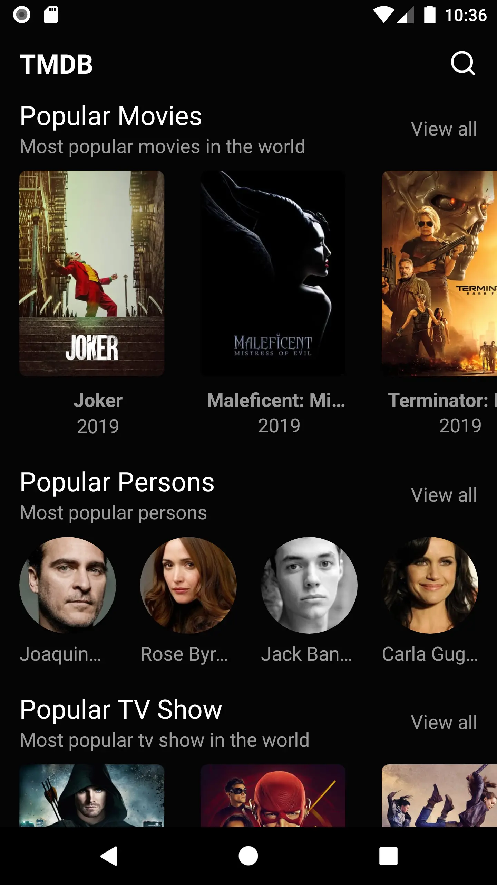

## Screenshots

#### Welcome Screen


#### Login Screen


#### Register Screen


#### Home Screen


## Before Run
- Create an api key in [themoviedb](http://themoviedb.org)
- Create a firebase project with package/bundleId called com.rnmovies
- In Authentication enable auth with email/password
- In Remote Config, create the following pairs (key/value):
-     YOUTUBE_URL: https://www.youtube.com/watch?v=
-     THEMOVIEDB_RESOURCE_URL: http://image.tmdb.org/t/p/
-     THEMOVIEDB_API_KEY: YOUR_THEMOVIEDB_API_KEY

## Run Instructions
```bash
git clone https://github.com/brunojs02/react-native-movies-app.git rnmovies
cd rnmovies && (npm i || yarn)
cd android/app
keytool -genkey -v -keystore debug.keystore -storepass android -alias androiddebugkey -keypass android -keyalg RSA -keysize 2048 -validity 10000
cd ../..
```
- Download google-services.json and put under android/app (for Android)
- Download GoogleService-Info.plist, put on ios/rnmovies and reference on xcode (for iOS)
```bash
cd react-native (run-android || run-ios)
```
