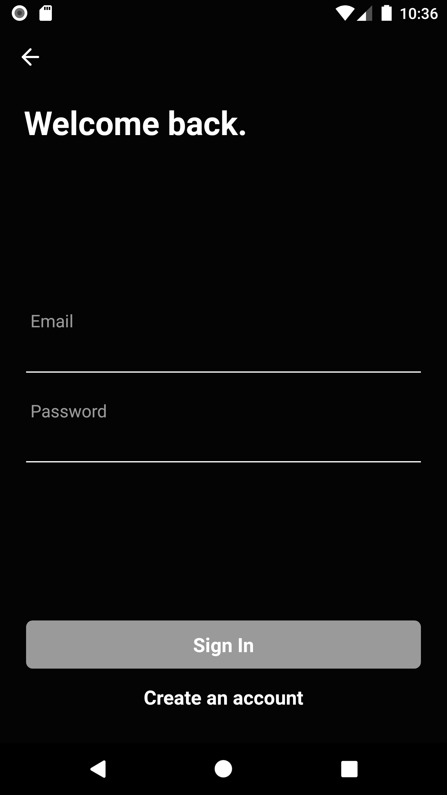

## Screenshots

#### Welcome Screen


#### Login Screen


#### Register Screen


#### Home Screen


## Before Run
- Make sure you have themoviedb api_key.
- put the api_key in env.json file
## Run Instructions
```bash
git clone https://github.com/brunojs02/react-native-movies-app.git rnmovies
cd rnmovies && (npm i || yarn)
cp env.example.json env.json
cd android/app
keytool -genkey -v -keystore debug.keystore -storepass android -alias androiddebugkey -keypass android -keyalg RSA -keysize 2048 -validity 10000
cd ../.. && react-native (run-android || run-ios)
```
